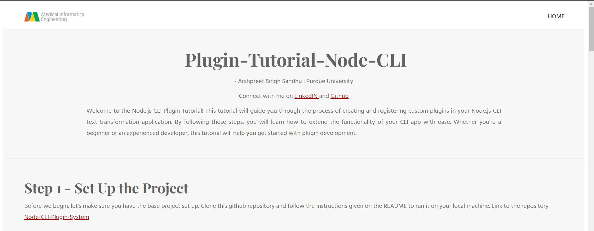
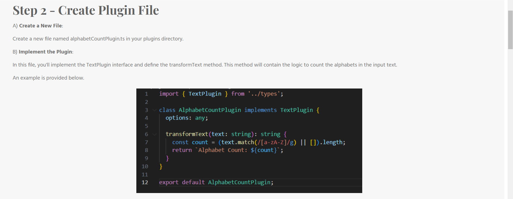
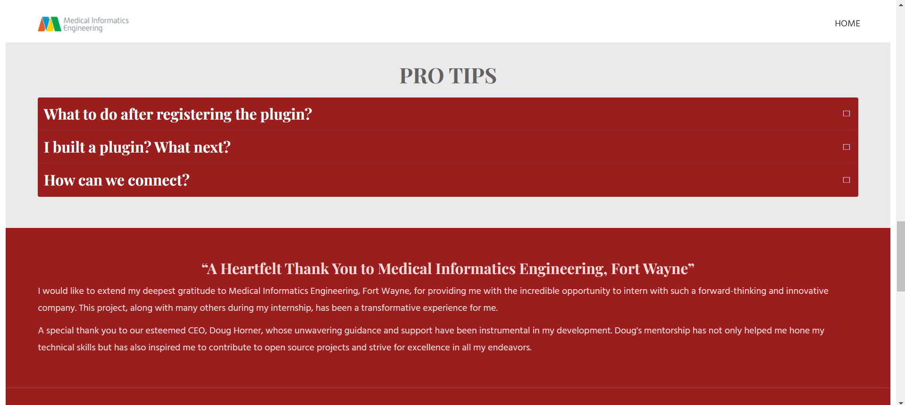

# Node.js CLI Plugin Tutorial
### Author: Arshpreet Singh Sandhu

Welcome to the Node.js CLI Plugin Tutorial! This tutorial will guide you through the process of creating and registering custom plugins in your Node.js CLI text transformation application. By following these steps, you will learn how to extend the functionality of your CLI app with ease. Whether you're a beginner or an experienced developer, this tutorial will help you get started with plugin development.

## Connect with Me

- [LinkedIn](https://www.linkedin.com/in/arshpreet-singh-sandhu/)
- [GitHub](https://github.com/arshpreetsinghsandhu)

## Table of Contents

1. [Introduction](#introduction)
2. [Step 1 - Set Up the Project](#step-1---set-up-the-project)
3. [Step 2 - Create Plugin File](#step-2---create-plugin-file)
4. [Step 3 - Register the Plugin](#step-3---register-the-plugin)
5. [Pro Tips](#pro-tips)
6. [Acknowledgments](#acknowledgments)
7. [About Me](#about-me)
8. [Comments and Feedback](#comments-and-feedback)

## Preview

